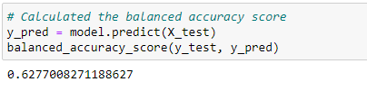

# Credit Risk Analysis

## Overview

In this analysis, we are applying machine learning to solve a real-world challenge: credit card risk. Credit risk is an inherently unbalanced classification problem, as good loans easily outnumber risky loans. This is the case with the dataset used in this analysis. Because of this, this analysis will use different techniques to train and evaluate models with unbalanced classes. 

## Results

### Naive Random Oversampling Results:

- Balanced Accuracy: 63%
- Precision High/Low: 0.01/1.00
- Recall: 57% of high risk applicants are identified as high risk and 68% of low risk applicants are identified as low risk.

### SMOTE Oversampling:

- Balanced Accuracy: 63%
- Precision High/Low: 0.01/1.00
- Recall: 62% of high risk applicants are identified as high risk and 63% of low risk applicants are identified as low risk.

### Cluster Centroids Undersampling:

- Balanced Accuracy: 63%
- Precision High/Low: 0.01/1.00
- Recall: 59% of high risk applicants are identified as high risk and 44% of low risk applicants are identified as low risk.

### SMOTEENN Combination Sampling:

- Balanced Accuracy: 51%
- Precision High/Low: 0.01/1.00
- Recall: 70% of high risk applicants are identified as high risk and 58% of low risk applicants are identified as low risk.

### Balanced Random Forester Classifer:

- Balanced Accuracy: 79%
- Precision High/Low: 0.03/1.00
- Recall: 70% of high risk applicants are identified as high risk and 87% of low risk applicants are identified as low risk.

### Easy Ensemble AdaBoost Classifer:

- Balanced Accuracy: 93%
- Precision High/Low: 0.09/1.00
- Recall: 92% of high risk applicants are identified as high risk and 94% of low risk applicants are identified as low risk.

## Summary

In this analysis we resampled using 6 different models to see which yielded the best results for the imbalanced classification problem within this data set. From our results we see that the first four (Naive Random Oversampling, SMOTE, Cluster Centroids Undersampling, and SMOTEENN) resulted in fairly low accuracy scores as well as imbalanced precision and recall scores. The Balanced Random Forest Classifier yielded better results than the prior four with an accuracy score of 79% and a more balanced precision and recall score. However, when choosing the best model for this dataset, the Easy Ensemble AdaBoost Classifer performed the best. It had a 93% accuracy score, a more balanced precision, and was able to predict 92% of high risk applicant and high risk, and 94% of low risk applicants as low risk. This would be the prefered model because as a credit company you would want a higher sensitivity so that you end up with the fewest amount of false negatives. 